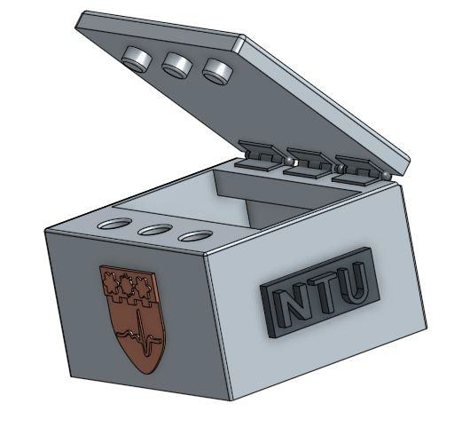
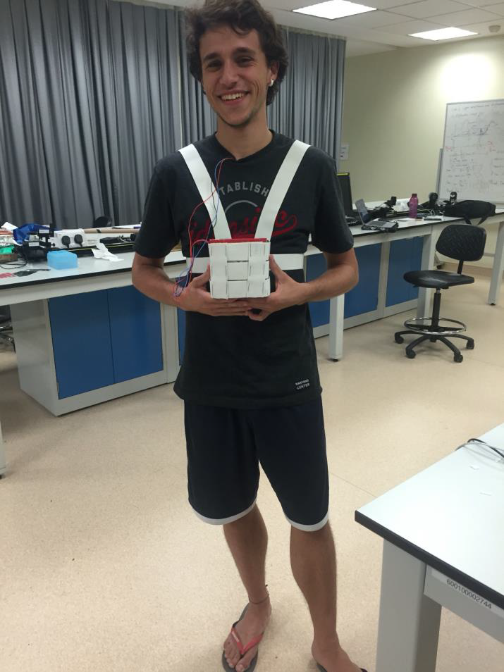

# Space Heart Attack

Space Heart Attack is part of a project which aims at using an individual's heart rate in real time to play a game. The system consists in a portable hardware device wirelessly connected to a smartphone running a game app. Here we present the main features as well as the first prototype.

## Motivations

The heart rate is a relatively easy-to-measure parameter that provides useful information about an individual's health status. Given its clinical applicability, it is used to assist in the diagnosis of common cardia diseases like arrhythmia and myocardial ischemia. As a team of biomedical engineers -and in the context of the Medical Device Design course at NTU, Singapore-, we decided to explore on how to achieve an accurate monitoring of the heart rate, developing also an innovative and original approach to display this parameter: Space Heart Attack.

## Concept

A portable electrocardiography (ECG) device carried by the user measures and sends the ECG signal via bluetooth connection. A computer running a LabVIEW program receives and processes the signal to extract the heart rate, and then sends this parameter to a smartphone running a game app to play with.

### Hardware Device

Main features:
* Three-lead system for biosignal measurement
* Two-stage signal amplification: instrumentation and adjustable amplifiers
* Band-pass analog filtering
* Status LEDs
* Battery powered
* Optimized power consumption: BLE communication, low-power microcontroller, carefully selected electrodes...
* Customized 3D-printed case to accommodate the entire device

Early prototype:
* Ag/AgCl electrodes
* Printed circuit board (PCB)
* Arduino UNO
* Bluetooth HC-05 module
* Green and Red LEDs controlled by LabVIEW
* PLA case with battery compartment and rotary hinge

	
	
	 <i> Left: 3D-printed case with ECG-customized NTU logo.	Right: Test subject wearing the device with a harness. </i>

### LabVIEW program

Main features:
* VISA serial interface
* Low-pass digital filtering
* ECG waveform display
* Peak detection for heart rate calculation
* Abnormal heart rate detection with LED signaling

### Game App

Main features:
* Interactive screen with info about usual and abnormal measurements of the heart rate
* Online highscores database to compete with friends
* Real-time heart rate monitoring via bluetooth connection
* Diverse power-ups and enemies with various effects
* Extreme game mode available
* Several platforms supported: PC / Mac / Android

The early prototype was developed for Android with Unity game engine and featured several users upon release on [Google Play Store](https://play.google.com/store/apps/details?id=com.SevaneGames.SpaceHeartAttack).

	
	

